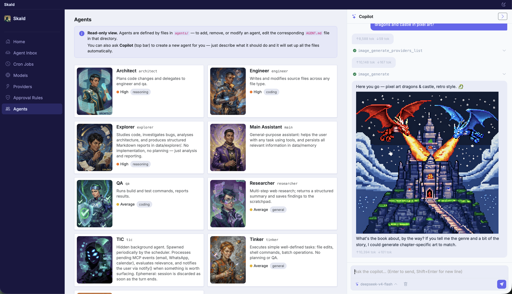

# Skald 🔥

> ⚠️ **Active development** — expect breaking changes. Things move fast.

<table><tr><td width="220"></td><td>

**Skald Circle** is a family AI assistant — a warm, collaborative space where families and small groups work together. With a supervised chat system for children and vulnerable people.

It's not a chatbot you talk to. It's a partner that nudges you, remembers what matters, and runs tasks on your behalf: reading your email, checking your calendar, sending WhatsApp messages, writing code, researching the web, generating images, and more.

</td></tr></table>

<p align="center">
  <a href="assets/images/screenshot-home-page.png"></a>
</p>

## Features

### 💬 Conversational agent

A chat interface where you talk to the LLM like you would any assistant. You can **interject at any time** — even mid-turn — and the agent folds your input into what it's doing. **Attach files** (images, documents, code) straight to your messages.

Specialized **sub-agents** can be delegated tasks — research, coding, planning, writing — and report back. Each runs with its own model and tools.

**Slash commands** package long, reusable prompts behind a short shortcut (`/model` to switch model, `/cost` to see what a turn cost, or your own `/command`). They're fully interactive: after firing, the agent can ask follow-ups and iterate.

<p align="center">
  <a href="assets/images/screenshot-web-app-agents-page.png"></a>
</p>

### ♻️ Self‑rewriting

This app can change everything about itself. It reads, edits, and rewrites its own source code — then restarts to run the new version. Ask it to add a feature, change its personality, or completely repurpose itself.

The idea is that **this is an almost‑empty container**. A starting point. Want an AI editor for books? Start here. Want an assistant that does something very specific? Take this code and tell the agent to rewrite itself into whatever you need. Need a Discord plugin? A specific MCP server? The agent writes the code, restarts, and guides you through connecting it. You don't need to know the code — just describe what you want.

### 🧠 Memory system

Two layers work together:

- **File-based memory** — the agent writes notes to markdown files in `data/memory/`, managing them autonomously like a personal wiki.
- **Honcho** (optional but recommended) — a self-hosted memory server that extracts long-term conclusions about you from every conversation. Over time, the agent learns your preferences, habits, and context.

### 🔌 Multi‑LLM support

Works with OpenAI, Anthropic, OpenRouter, Ollama, LM Studio, DeepSeek — anything with an API. Each agent can use a different model, and you can switch on the fly (`/model`, `/models`).

### ✅ Approvals & unified inbox

The agent can do a lot on its own, but some actions are too sensitive to run unchecked. By default, **anything not explicitly allowed requires your approval** — shell commands, file writes outside whitelisted paths, restarts. You see exactly what the agent wants to do, with a diff when files are involved. Approve, reject, or add a note.

Beyond yes/no approvals, the agent can also **ask structured questions** when it needs clarification (a multiple-choice, a number, a confirmation) — and MCP servers it connects to can request input too.

If you're away, everything pending — approvals, questions, and briefings from the background agent — collects in the **Agent Inbox**, so you can decide when you come back. Rules and permission groups are fully configurable: which tools need approval, which are always allowed, which are blocked, and which directories each session may touch.

### 🎨 Multi‑modal

- **Image generation** — cloud (OpenRouter, …) or fully local via **ComfyUI**, with a skill suite for building and repairing workflows.
- **Speech‑to‑text** — send a voice message (OpenAI / ElevenLabs cloud, or local whisper.cpp on-device).
- **Text‑to‑speech** — the agent can talk back (OpenAI, ElevenLabs, or local Orpheus 3B / Kokoro — lightweight and multilingual).

### 👁️ Background agent (TIC)

Every 15 minutes, a background agent checks your incoming events and decides what matters — **Gmail**, **Google Calendar**, **WhatsApp**. If something needs your attention, it briefs your conversational agent, which can then alert you. The notification rules are **yours**: you tell the agent what to filter and what to escalate.

### ⏰ Cron jobs

Tell the agent *"send me a daily summary at 9am"* or *"check the weather every morning and remind me to take an umbrella."* The agent creates, manages, and runs scheduled tasks — no crontab editing.

### 📋 Projects & tickets

Tie a unit of work to a directory on disk. A **project** gives agents standing context — path, description, permissions — so they don't need re-explaining every time. Work it two ways: fire-and-forget **tickets** (one background agent run each, tracked on a board), or an **interactive chat** with the project's coordinator agent, which delegates to specialist sub-agents.

### 🧩 MCP servers

Model Context Protocol servers give the agent direct access to external services:

| MCP server | Tools exposed |
|-----------|--------------|
| **Gmail** | Read, send, search, manage labels |
| **Google Calendar** | List events, create/update/delete, RSVP |
| **Google Maps** | Transit directions, places, geocoding |
| **WhatsApp** | Read messages, send messages, list chats |
| **Flights (SerpAPI)** | Search flights and fares |

These ship as ready-to-use custom servers. Any other MCP server can be added at runtime — the agent can write a new one from scratch, modify an existing one, or register it on its own.

### 🧰 Skills

Reusable capability packages that extend the agent without touching the core code — PDF/DOCX handling, a ComfyUI image-workflow suite, architecture diagrams, slide generation, iOS development, and more. The agent discovers them automatically and invokes them when relevant. A `skill-creator` lets it author brand-new skills on the fly.

### 📄 File viewer & live documents

The web UI previews files directly — Markdown, source code, images, SVG, PDF. **LaTeX (`.tex`) is compiled to PDF on the server** and rendered inline, with a file watcher that recompiles and reloads the moment a source fragment changes. Tool outputs link straight to the files they touched.

## Mobile app

<table><tr><td width="220"><a href="assets/images/skald-mobile-app-screen.png"></a></td><td>

The web app works on mobile — add it to your phone's Home Screen to chat, approve requests, and manage your inbox.

For a tighter experience there's a companion **iOS app** → **[SkaldAgent/skald-ios](https://github.com/SkaldAgent/skald-ios)**. It pairs with your Skald over an **end-to-end-encrypted relay** (powered by the **mobile-connector** plugin): pairing, inbox sync, and **push notifications** so you're alerted to approvals and questions even when the app is closed. A smart delay suppresses the phone push if you've already handled it on your computer.

</td></tr></table>

## Plugins

| Plugin | What it does |
|--------|-------------|
| **Mobile connector** | Bridges the agent to the iOS app over an end-to-end-encrypted relay — pairing, inbox sync, push |
| **Telegram** | Chat with your agent from Telegram, including approvals |
| **Tailscale** | Exposes the web app on your tailnet, reachable from any device in your mesh |
| **Honcho** | Long-term memory server |
| **ComfyUI** | Local image generation |
| **Whisper (local)** | On-device speech-to-text via whisper.cpp |
| **ElevenLabs** | Cloud text-to-speech and speech-to-text |
| **Orpheus 3B / Kokoro** | Local, on-device text-to-speech |

To enable a plugin, ask the agent in any active chat — it will guide you through the setup.

## Getting started

The only prerequisite is **Cargo** (Rust's build tool and package manager).

**macOS (Homebrew):** `brew install rust`
**Windows:** download and run [rustup-init.exe](https://rustup.rs/)
**Any platform:** `curl --proto '=https' --tlsv1.2 -sSf https://sh.rustup.rs | sh`

### First launch (no config needed)

```sh
./run.sh        # macOS / Linux
run.bat         # Windows
```

The script sets up a Python virtualenv (optional — needed for MCP servers like Gmail/Calendar) and runs the app in a supervisor loop. Open `http://localhost:3000`. Everything else — SQLite, web server, MCP connections — is handled automatically. To customise settings (ports, logging, …), edit `config.yml`, created on first launch from `default.config.yaml`.

### Docker

```sh
docker build -t skald .
touch database.db && mkdir -p data
docker run -p 3001:3000 -v ./data:/app/data -v ./database.db:/app/database.db skald
```

Open `http://localhost:3001`. The container includes the full Rust toolchain, so self-recompilation works just the same. For more options see [docker.md](docker.md).

### Add an LLM provider

The last step: register at least one **LLM provider** and a **model** in the **Models Hub** (`localhost:3000/models`). All credentials are stored in SQLite and managed entirely through the web UI — no config file editing required.

## Status

This is a personal project, actively used every day. It's not a polished product — it's a living tool that changes as I need it to. Breaking changes happen; the schema or config may shift. If you try it and something breaks, open an issue — but expect things to be rough around the edges. That said, it works, it helps, and it's only going to get better.

---

Built with Rust, Tokio, Axum, SQLite, and a lot of coffee. Rust was a deliberate choice: a single compact binary that runs comfortably on a Raspberry Pi or a low-power NAS — the kind of hardware already on 24/7 at home. The goal was an assistant that lives *on your machine*, including the smallest one you own.
