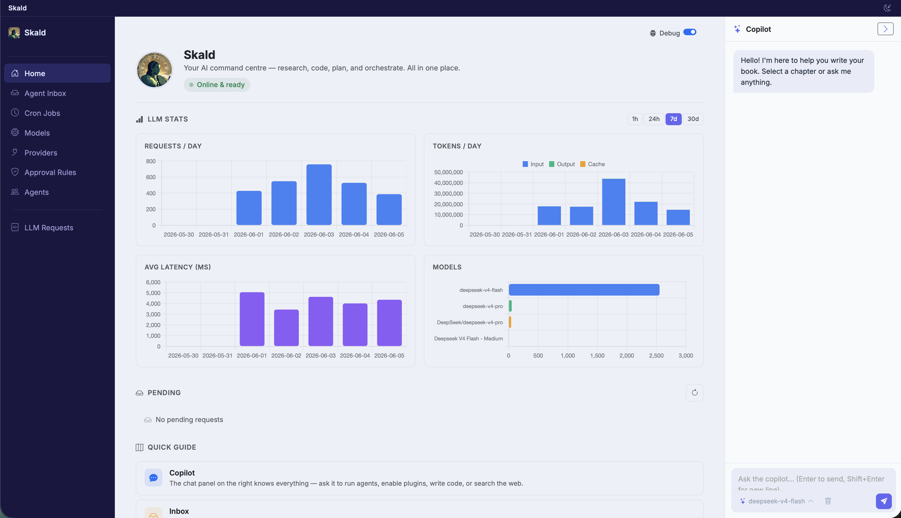

# Skald Circle 🔥

> ⚠️ **Active development** — expect breaking changes. Things move fast.

<table><tr><td width="220"></td><td>

**Skald Circle** is a private AI assistant for the whole family. It runs on hardware you own — a mini-PC, a NAS, a Raspberry Pi — and gives every member of the household their own assistant, their own private space, and a shared common ground to plan, remember and get things done together.

No cloud account. No subscription feeding your conversations to someone else's servers. Your home, your data, your rules.

</td></tr></table>

<p align="center">
  <a href="assets/images/screenshot-home-page.png"></a>
</p>

## Why a *family* assistant?

AI assistants are becoming personal: they read our email, remember our plans, help us think. But today's assistants are built for one person, locked inside someone else's cloud. A household doesn't work that way — some things are private, some things are shared, and some people need looking after.

Skald Circle is built around exactly that:

- **Everyone gets their own space.** Each family member has their own account, their own assistant, their own conversations and memory. Yours is yours.
- **Some things belong to everyone.** A shared family memory — the shopping list, the Wi-Fi password, "what was the name of that plumber?" — plus shared folders for documents and photos, with per-person read or read-write access.
- **Privacy between adults is real.** Your personal space is encrypted with your password. Nobody else — not even the family admin who runs the box — can read it *through normal use of the system*. And because the code is open and auditable, sneaking around would leave traces. That's an honest promise, not a magic one — see [Privacy & security](#privacy--security--the-honest-version).
- **Kids deserve an assistant parents can trust.** This is our north star: assistants for children and vulnerable family members, with a simpler interface, carefully limited capabilities, and parents in the loop. Not surveillance by stealth — the child knows the rules, and real concerns reach a human, not a dashboard. See [the road ahead](#the-road-ahead).

## What it does

### 💬 A chat that actually does things

Talk to your assistant like you would to any chat — then watch it act. It reads and writes files, runs commands in its sandbox, checks your calendar, drafts your email, searches the web, generates images. **Attach photos and documents** straight to the conversation, and **interrupt it mid-work** to change your mind.

Specialist **sub-agents** can be delegated a job — research, planning, writing — and report back. **Slash commands** (`/model`, `/cost`, your own) package repeated prompts into shortcuts.

### 🧠 Two memories: yours and ours

The assistant keeps notes like a personal wiki, in two clearly separated places:

- **Private memory** — what it learns about *you*: preferences, projects, context. Stored encrypted, for your assistant's eyes only.
- **Shared memory** — the household's common notebook, readable by the whole family. Writes here need a human approval, so nobody's assistant quietly pushes personal things into the family space.

Both are full-text searchable, and the assistant manages them on its own.

### 🔌 Connectors & the Marketplace

Connectors give assistants hands: email, calendars, maps, web search and more — through an app-store-like **Marketplace** built into the UI.

The trust model is deliberate: **only people decide what gets installed, never the AI.** The admin browses the marketplace and adds vetted connectors to the family catalog; each member then *activates* the ones they want and signs in with their own account (Google sign-in with OAuth is built in — Gmail is the first). Shared, key-based services (like web search) can be enabled once for everyone. The marketplace feed is plain static files — point it at your own mirror and run fully offline.

### 🛡️ Safe by default

- **Sandboxed actions.** When the assistant runs a command, it happens inside a locked-down container that only sees that person's files and the folders shared with them — never the host machine, never a sibling's space.
- **Approvals & inbox.** Anything sensitive — shell commands, writes outside whitelisted paths — requires a human yes. Out of the house? Pending requests collect in a single **Inbox** you can clear from your phone.
- **You choose where thinking happens.** Works with OpenAI, Anthropic, OpenRouter, DeepSeek — or fully local models via **Ollama / LM Studio**, so conversations can literally never leave the house. Mix and match per agent, switch on the fly.

### ⏰ Routines & reminders

*"Remind me every morning at 8 if it's going to rain."* *"Every Sunday, help me plan the week's meals."* Scheduled jobs are created by simply asking — no crontab, no config files.

### 🎨 Voice & images

Send a **voice message** (transcribed locally via whisper.cpp or in the cloud), let the assistant **talk back** (local Kokoro/Orpheus, or ElevenLabs/OpenAI), and **generate images** — locally via ComfyUI or through cloud providers.

### 🌍 Speaks your language

The interface is translated (English, Italiano, Français), and each family member picks their own. The assistant itself chats in whatever language you use.

### 📱 Everywhere in the house

The web app runs on any browser, phone included — add it to your Home Screen to chat, approve requests and check the inbox. There's a companion **iOS app** with push notifications ([SkaldAgent/skald-ios](https://github.com/SkaldAgent/skald-ios)), and a **Telegram** bridge if you prefer to chat from there.

## Privacy & security — the honest version

Privacy products love the word "impossible". We prefer precise:

- **Encrypted personal space.** Each adult's database is encrypted at rest (SQLCipher), unlocked by a key derived from their password (Argon2id, memory-hard). The key lives only in RAM, from first login until the box restarts — a rebooted machine means everyone's space is sealed again until they sign in.
- **Who we're defending against.** Our threat model is the *tempted admin*: the family member who owns the box and, in a moment of mistrust, might be tempted to peek. Against them, your encrypted space is as strong as your password plus a deliberately expensive key derivation. We do **not** claim to stop a forensic attacker who owns the hardware — no honest software can.
- **What's *not* hidden from the admin.** Files on disk (documents, photos, downloads) live on the shared box in the clear, because the assistant's tools need to work on them — they're isolated from *other family members*, not from the person who runs the machine. Your notes, chats and memories are the private part; your files are on the family computer, like files on any family computer.
- **Shared is shared.** The family memory is readable by all members by design — that's its job.
- **Open and verifiable.** Everything is open source, so the promise above is checkable — and a tampered build would be detectable. We claim *transparent, verifiable privacy*, never "mathematically impossible".

For the most sensitive conversations, pair this with a **local model** and nothing leaves the house at all: that's a technical guarantee, not a policy one.

## The road ahead

The multi-user foundation — accounts, roles, encrypted spaces, shared memory and folders, the connector marketplace — is built and in daily use. Next, the foundation grows toward the people who need the most care:

- **Supervised accounts for children.** Roles are already data, not code: a "kids" profile is a configuration — simplified interface (already available), restricted tools, no actions toward the outside world, and activity readable by a parent, who is their data controller. As they grow, the account grows with them — more autonomy, eventually a private encrypted space of their own.
- **A safety net, done with care.** An assistant a child confides in must know when to reach for a human. The principle: the child *knows* the safety rule ("what you tell me stays between us, unless I'm worried you might get hurt — then I tell someone who loves you"), thresholds stay high, and alerts carry concern and urgency to a parent, not transcripts. This is the feature we hold to the highest bar of care.
- **More sign-in connectors** (Calendar, Drive and beyond), richer shared-folder management, and polish everywhere.

## Getting started

**Requirements** (macOS / Linux):

- **Docker** — used to sandbox the assistant's actions, one container per family member. Must be running before the app starts.
- **Rust** — to build the binary (`curl --proto '=https' --tlsv1.2 -sSf https://sh.rustup.rs | sh`, or `brew install rust` on macOS).
- **Python** (optional) — some connectors are Python-based; a virtualenv is created automatically on first run.

```sh
./build.sh   # build the app (release binary)
./run.sh     # first-run setup, then start
```

On first launch a short wizard creates the family admin account. Then open **http://localhost:9000**, sign in, and add at least one **LLM provider + model** in the Models Hub — credentials are managed entirely from the web UI. Invite the rest of the family from the Users page.

Meant to run as a background service on an always-on machine (a mini-server, a spare box on the LAN): `run.sh` supervises the process and restarts it on demand, so the assistant is reachable from every device in the house.

## Status

This is a personal project, actively used every day by its author's household. It's not a polished product — it's a living system that changes as we need it to. Breaking changes happen; the schema may shift (greenfield, no migrations yet). If you try it and something breaks, open an issue — but expect rough edges. That said: it works, it helps, and it's only getting better.

---

Built with Rust, Tokio, Axum, SQLite, and a lot of coffee. Rust was a deliberate choice: a single compact binary that runs comfortably on a Raspberry Pi or a low-power NAS — the kind of hardware already on 24/7 at home. The goal is an assistant that lives *in your house*, including the smallest machine you own.
